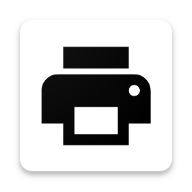
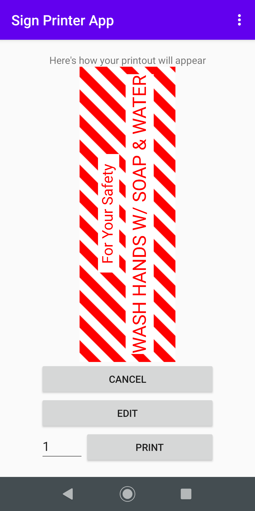

# Sign Printer App 

**Making it simpler to use existing Brother label makers for printing signage**

Sign Printer App supports printing and customizing basic signs to be printed on QL-820NWB or QL-1100NWB Brother-based label printers.

Sign Printer App includes some basic signage to allow small businesses to communicate some common knowledge around the current COVID-19 pandemic.

# Development Overview

This is a Native Android application targeting SDK version 19 or higher (Android 4.4)

## Developer Setup

A full gradle project is provided but there are dependencies that are not bundled.
**Dependencies:** [Brother Print Library](https://developerprogram.brother-usa.com/sdk-download)
